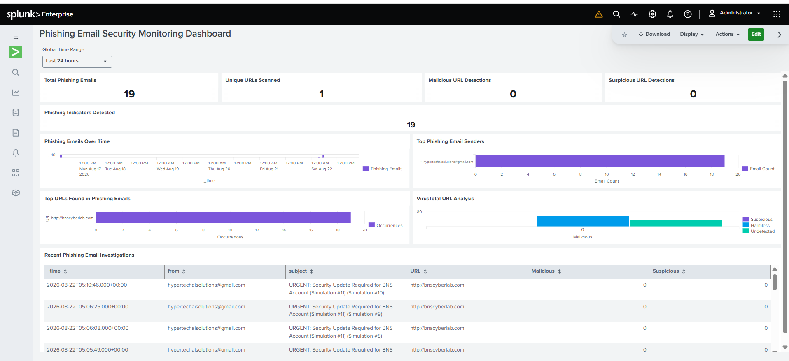
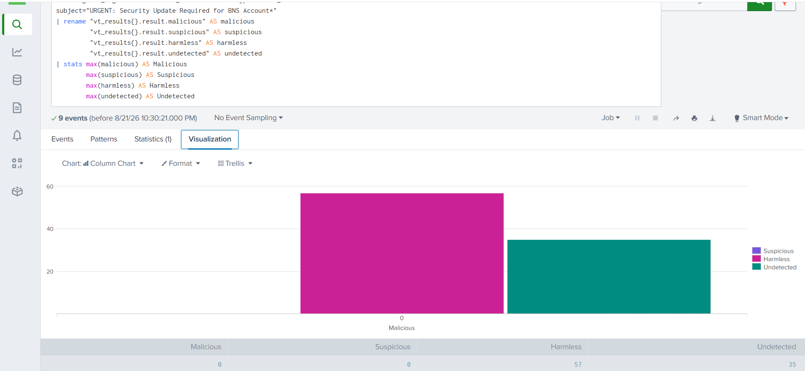
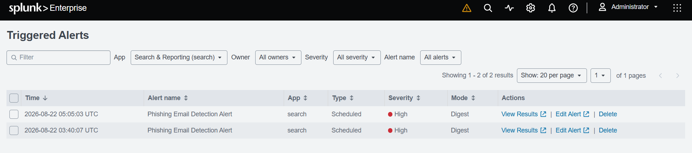
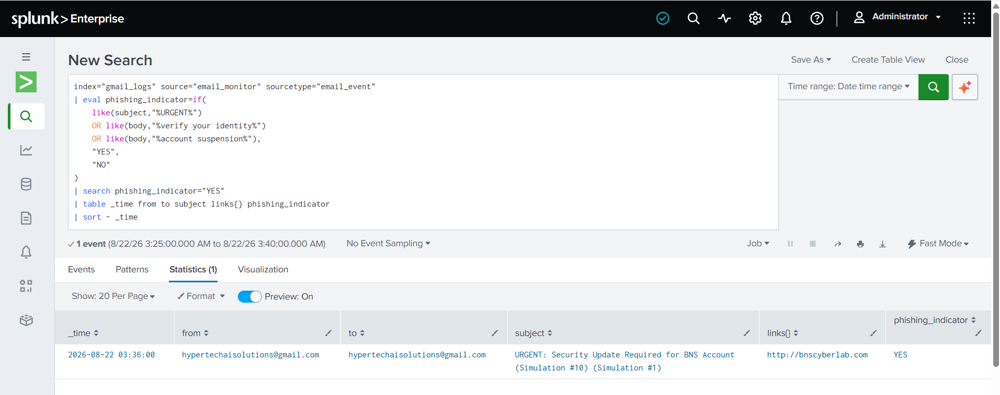
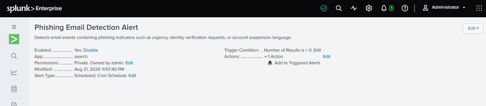
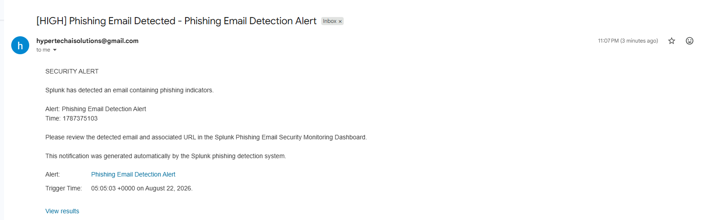

# Automated Phishing Email Detection & SOC Alerting Lab

## Project Overview

This project demonstrates an end-to-end phishing email detection and security monitoring workflow using Python, Splunk Enterprise, Gmail, and VirusTotal.

The lab was designed to simulate how a Security Operations Center (SOC) can automatically collect email data, extract potentially suspicious URLs, enrich those URLs with threat intelligence, forward structured security events to a SIEM, detect phishing indicators, and notify an analyst when suspicious activity is identified.

A Python-based phishing simulation generates controlled test emails in the lab environment. A separate email monitoring script retrieves the messages from Gmail, extracts relevant information such as the sender, recipient, subject, body, attachments, and URLs, and submits URLs to VirusTotal for reputation analysis.

The enriched email events are then forwarded to Splunk Enterprise through the HTTP Event Collector (HEC) and stored in a dedicated index for analysis.

Splunk is used to:

- Monitor phishing-related email activity
- Analyze email senders and embedded URLs
- Display VirusTotal enrichment results
- Identify phishing indicators using SPL detection logic
- Visualize security activity through a SOC dashboard
- Generate high-severity scheduled alerts
- Send automated email notifications to the analyst

The project demonstrates the integration of security automation, threat intelligence, SIEM monitoring, detection engineering, and SOC alerting within a controlled lab environment.

## Architecture

The project follows the workflow below:

Phishing Simulation (`phish_sender.py`)
        ↓
Gmail
        ↓
Python Email Monitor (`email_monitor.py`)
        ↓
Email Parsing & URL Extraction
        ↓
VirusTotal API Enrichment
        ↓
Structured JSON Security Event
        ↓
Splunk HTTP Event Collector (HEC)
        ↓
Splunk `gmail_logs` Index
        ↓
SPL Detection & Analysis
        ↓
Phishing Detection Alert
        ↓
SOC Dashboard + Analyst Email Notification

## Technologies Used

- Python 3
- Splunk Enterprise
- Splunk HTTP Event Collector (HEC)
- Splunk Search Processing Language (SPL)
- Gmail / IMAP
- VirusTotal API
- Kali Linux
- Ubuntu Server
- VirtualBox
- SMTP / Gmail App Password
- JSON
- python-dotenv
- Requests

## Lab Environment

The project was developed in a virtualized cybersecurity lab environment using VirtualBox. Separate virtual machines were used to isolate the security monitoring components and simulate a realistic SOC architecture.

### Kali Linux

Kali Linux was used as the automation and security testing system.

Primary functions included:

- Running the `phish_sender.py` phishing simulation script
- Running the `email_monitor.py` monitoring and automation script
- Connecting to Gmail through IMAP
- Extracting URLs and email metadata
- Querying the VirusTotal API for URL reputation
- Sending enriched security events to Splunk through HEC
- Testing connectivity between the monitoring system and Splunk

### Ubuntu Server

Ubuntu Server was used to host Splunk Enterprise.

Primary functions included:

- Hosting the Splunk Enterprise SIEM
- Receiving JSON events through the Splunk HTTP Event Collector (HEC)
- Storing email security events in the `gmail_logs` index
- Running SPL searches and phishing detection rules
- Hosting the phishing monitoring dashboard
- Generating scheduled high-severity alerts
- Sending automated email notifications to the analyst

### Gmail

Gmail was used as the email platform for the controlled phishing simulation.

The Python monitoring script connects to Gmail through IMAP and processes messages from the monitored mailbox. SMTP was also configured in Splunk to deliver automated phishing alert notifications to the analyst.

### VirusTotal

VirusTotal was integrated through its API to provide threat-intelligence enrichment for URLs extracted from monitored emails.

For each extracted URL, the monitoring script records available reputation statistics such as:

- Malicious detections
- Suspicious detections
- Harmless detections
- Undetected results
- VirusTotal analysis ID

This enrichment allows Splunk analysts to examine both email-based phishing indicators and external URL reputation data.

## Network and Data Flow

The primary communication flow in the lab is:

1. `phish_sender.py` generates a controlled phishing simulation email.
2. The simulated email is delivered to the monitored Gmail mailbox.
3. `email_monitor.py` retrieves and parses the email.
4. Embedded URLs are extracted from the message.
5. URLs are submitted to the VirusTotal API for reputation analysis.
6. Email metadata and VirusTotal results are combined into a structured JSON event.
7. The event is transmitted to Splunk Enterprise using HEC over port `8088`.
8. Splunk indexes the event in `gmail_logs` with the `email_event` sourcetype.
9. SPL detection logic evaluates the event for phishing indicators.
10. Matching events trigger a high-severity Splunk alert.
11. Splunk records the alert under Triggered Alerts and sends an automated email notification to the analyst.

## Project Evidence

### Splunk SOC Dashboard

The dashboard provides a centralized view of phishing activity, URL analysis, sender activity, and investigation data.



---

### VirusTotal Enrichment

Extracted URLs are submitted to VirusTotal, and the resulting reputation data is added to the event before ingestion into Splunk.



---

### Triggered High-Severity Alert

Splunk automatically creates a high-severity alert when the phishing detection rule returns matching events.



---

### Phishing Detection Result

The SPL detection logic evaluates phishing indicators such as urgency, identity verification requests, and account suspension language.

The event below was classified with:

`phishing_indicator = YES`



---

### Alert Configuration

The phishing detection rule is configured as a scheduled alert with automated trigger actions.



---

### Analyst Email Notification

When the phishing alert is triggered, Splunk sends an automated email notification to the analyst.



## Detection Logic & SPL Queries

Splunk Search Processing Language (SPL) is used to analyze the email events ingested from the Python monitoring pipeline, identify phishing indicators, and support SOC investigation and alerting.

### Phishing Email Detection

The primary detection rule evaluates email subject and body content for common phishing indicators, including urgency, identity verification requests, and account suspension language.

```spl
index="gmail_logs" source="email_monitor" sourcetype="email_event"
| eval phishing_indicator=if(
    like(subject,"%URGENT%")
    OR like(body,"%verify your identity%")
    OR like(body,"%account suspension%"),
    "YES",
    "NO"
)
| search phishing_indicator="YES"
| table _time from to subject links{} phishing_indicator
| sort - _time
```

This search identifies events containing the defined phishing indicators and assigns them a `phishing_indicator` value of `YES`. Matching events are used by the scheduled **Phishing Email Detection Alert**.

### VirusTotal URL Enrichment

URL reputation information returned by VirusTotal is extracted from the enriched email events and summarized in Splunk.

```spl
index="gmail_logs" source="email_monitor" sourcetype="email_event"
subject="URGENT: Security Update Required for BNS Account*"
| rename "vt_results{}.result.malicious" AS malicious
         "vt_results{}.result.suspicious" AS suspicious
         "vt_results{}.result.harmless" AS harmless
         "vt_results{}.result.undetected" AS undetected
| stats max(malicious) AS Malicious
        max(suspicious) AS Suspicious
        max(harmless) AS Harmless
        max(undetected) AS Undetected
```

This allows the SOC analyst to compare content-based phishing indicators with URL reputation data rather than relying on a single detection source.

### Alerting Logic

The phishing detection search is configured as a scheduled Splunk alert. The alert runs every five minutes against recent email events and triggers when:

```text
Number of Results > 0
```

When triggered, Splunk:

1. Creates an entry in **Triggered Alerts**.
2. Assigns the configured alert severity.
3. Provides access to the matching phishing event.
4. Sends an automated email notification to the analyst.

This demonstrates an end-to-end detection workflow from email collection and enrichment through SIEM detection, alert generation, and analyst notification.


