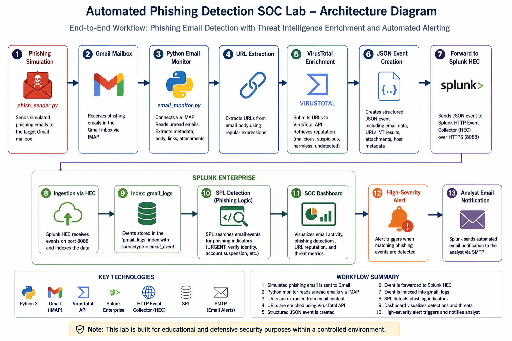

# Automated Phishing Email Detection & SOC Alerting Lab

## Project Overview

This project demonstrates an end-to-end phishing email detection and security monitoring workflow using Python, Splunk Enterprise, Gmail, and VirusTotal.

The lab was designed to simulate how a Security Operations Center (SOC) can automatically collect email data, extract potentially suspicious URLs, enrich those URLs with threat intelligence, forward structured security events to a SIEM, detect phishing indicators, and notify an analyst when suspicious activity is identified.

A Python-based phishing simulation generates controlled test emails in the lab environment. A separate email monitoring script retrieves the messages from Gmail, extracts relevant information such as the sender, recipient, subject, body, attachments, and URLs, and submits URLs to VirusTotal for reputation analysis.

The enriched email events are then forwarded to Splunk Enterprise through the HTTP Event Collector (HEC) and stored in a dedicated index for analysis.

Splunk is used to:

- Monitor phishing-related email activity
- Analyze email senders and embedded URLs
- Display VirusTotal enrichment results
- Identify phishing indicators using SPL detection logic
- Visualize security activity through a SOC dashboard
- Generate high-severity scheduled alerts
- Send automated email notifications to the analyst

The project demonstrates the integration of security automation, threat intelligence, SIEM monitoring, detection engineering, and SOC alerting within a controlled lab environment.

## Architecture

## Architecture

The project follows the workflow below:

**Phishing Simulation (`phish_sender.py`)**  
↓  
**Gmail**  
↓  
**Python Email Monitor (`email_monitor.py`)**  
↓  
**Email Parsing & URL Extraction**  
↓  
**VirusTotal API Enrichment**  
↓  
**Structured JSON Security Event**  
↓  
**Splunk HTTP Event Collector (HEC)**  
↓  
**Splunk `gmail_logs` Index**  
↓  
**SPL Detection & Analysis**  
↓  
**Phishing Detection Alert**  
↓  
**SOC Dashboard + Analyst Email Notification**

### Architecture Diagram

The diagram below illustrates the complete data flow from controlled phishing simulation through threat-intelligence enrichment, Splunk detection, and analyst notification.




## Technologies Used

- Python 3
- Splunk Enterprise
- Splunk HTTP Event Collector (HEC)
- Splunk Search Processing Language (SPL)
- Gmail / IMAP
- VirusTotal API
- Kali Linux
- Ubuntu Server
- VirtualBox
- SMTP / Gmail App Password
- JSON
- python-dotenv
- Requests
  

## Lab Environment

The project was developed in a virtualized cybersecurity lab environment using VirtualBox. Separate virtual machines were used to isolate the security monitoring components and simulate a realistic SOC architecture.


### Kali Linux

Kali Linux was used as the automation and security testing system.

Primary functions included:

- Running the `phish_sender.py` phishing simulation script
- Running the `email_monitor.py` monitoring and automation script
- Connecting to Gmail through IMAP
- Extracting URLs and email metadata
- Querying the VirusTotal API for URL reputation
- Sending enriched security events to Splunk through HEC
- Testing connectivity between the monitoring system and Splunk
  

### Ubuntu Server

Ubuntu Server was used to host Splunk Enterprise.

Primary functions included:

- Hosting the Splunk Enterprise SIEM
- Receiving JSON events through the Splunk HTTP Event Collector (HEC)
- Storing email security events in the `gmail_logs` index
- Running SPL searches and phishing detection rules
- Hosting the phishing monitoring dashboard
- Generating scheduled high-severity alerts
- Sending automated email notifications to the analyst
  

### Gmail

Gmail was used as the email platform for the controlled phishing simulation.

The Python monitoring script connects to Gmail through IMAP and processes messages from the monitored mailbox. SMTP was also configured in Splunk to deliver automated phishing alert notifications to the analyst.


### VirusTotal

VirusTotal was integrated through its API to provide threat-intelligence enrichment for URLs extracted from monitored emails.

For each extracted URL, the monitoring script records available reputation statistics such as:

- Malicious detections
- Suspicious detections
- Harmless detections
- Undetected results
- VirusTotal analysis ID

This enrichment allows Splunk analysts to examine both email-based phishing indicators and external URL reputation data.


## Network and Data Flow

The primary communication flow in the lab is:

1. `phish_sender.py` generates a controlled phishing simulation email.
2. The simulated email is delivered to the monitored Gmail mailbox.
3. `email_monitor.py` retrieves and parses the email.
4. Embedded URLs are extracted from the message.
5. URLs are submitted to the VirusTotal API for reputation analysis.
6. Email metadata and VirusTotal results are combined into a structured JSON event.
7. The event is transmitted to Splunk Enterprise using HEC over port `8088`.
8. Splunk indexes the event in `gmail_logs` with the `email_event` sourcetype.
9. SPL detection logic evaluates the event for phishing indicators.
10. Matching events trigger a high-severity Splunk alert.
11. Splunk records the alert under Triggered Alerts and sends an automated email notification to the analyst.
    

## Project Evidence

### Splunk SOC Dashboard

The dashboard provides a centralized view of phishing activity, URL analysis, sender activity, and investigation data.


---

### VirusTotal Enrichment

Extracted URLs are submitted to VirusTotal, and the resulting reputation data is added to the event before ingestion into Splunk.


---

### Triggered High-Severity Alert

Splunk automatically creates a high-severity alert when the phishing detection rule returns matching events.


---

### Phishing Detection Result

The SPL detection logic evaluates phishing indicators such as urgency, identity verification requests, and account suspension language.

The event below was classified with:

`phishing_indicator = YES`


---

### Alert Configuration

The phishing detection rule is configured as a scheduled alert with automated trigger actions.


---

### Analyst Email Notification

When the phishing alert is triggered, Splunk sends an automated email notification to the analyst.


## Detection Logic & SPL Queries

Splunk Search Processing Language (SPL) is used to analyze the email events ingested from the Python monitoring pipeline, identify phishing indicators, and support SOC investigation and alerting.


### Phishing Email Detection

The primary detection rule evaluates email subject and body content for common phishing indicators, including urgency, identity verification requests, and account suspension language.

```spl
index="gmail_logs" source="email_monitor" sourcetype="email_event"
| eval phishing_indicator=if(
    like(subject,"%URGENT%")
    OR like(body,"%verify your identity%")
    OR like(body,"%account suspension%"),
    "YES",
    "NO"
)
| search phishing_indicator="YES"
| table _time from to subject links{} phishing_indicator
| sort - _time
```

This search identifies events containing the defined phishing indicators and assigns them a `phishing_indicator` value of `YES`. Matching events are used by the scheduled **Phishing Email Detection Alert**.


### VirusTotal URL Enrichment

URL reputation information returned by VirusTotal is extracted from the enriched email events and summarized in Splunk.

```spl
index="gmail_logs" source="email_monitor" sourcetype="email_event"
subject="URGENT: Security Update Required for BNS Account*"
| rename "vt_results{}.result.malicious" AS malicious
         "vt_results{}.result.suspicious" AS suspicious
         "vt_results{}.result.harmless" AS harmless
         "vt_results{}.result.undetected" AS undetected
| stats max(malicious) AS Malicious
        max(suspicious) AS Suspicious
        max(harmless) AS Harmless
        max(undetected) AS Undetected
```

This allows the SOC analyst to compare content-based phishing indicators with URL reputation data rather than relying on a single detection source.


### Alerting Logic

The phishing detection search is configured as a scheduled Splunk alert. The alert runs every five minutes against recent email events and triggers when:

```text
Number of Results > 0
```

When triggered, Splunk:

1. Creates an entry in **Triggered Alerts**.
2. Assigns the configured alert severity.
3. Provides access to the matching phishing event.
4. Sends an automated email notification to the analyst.

This demonstrates an end-to-end detection workflow from email collection and enrichment through SIEM detection, alert generation, and analyst notification.


## Setup & Installation

The following steps outline how to reproduce the lab environment.

### 1. Clone the Repository

```bash
git clone https://github.com/Yem-Tech/automated-phishing-detection-soc-lab.git
cd automated-phishing-detection-soc-lab
```

### 2. Install Python Dependencies

```bash
pip3 install -r requirements.txt
```

### 3. Configure Environment Variables

Create a local `.env` file based on `.env.example`:

```text
EMAIL_USER=your_email@example.com
EMAIL_PASS=your_google_app_password
VT_API_KEY=your_virustotal_api_key
SPLUNK_TOKEN=your_splunk_hec_token
SPLUNK_URL=https://YOUR_SPLUNK_SERVER:8088/services/collector
SPLUNK_INDEX=gmail_logs
```

Do not commit the real `.env` file to GitHub.

### 4. Configure Gmail

1. Enable 2-Step Verification on the Gmail account used for the lab.
2. Generate a Google App Password.
3. Store the App Password in the local `.env` file as `EMAIL_PASS`.
4. Ensure Gmail IMAP access is available for the account.

### 5. Configure VirusTotal

1. Create or sign in to a VirusTotal account.
2. Obtain the VirusTotal API key.
3. Store the API key in `.env` as `VT_API_KEY`.

### 6. Configure Splunk Enterprise

On the Ubuntu Server hosting Splunk:

1. Install and start Splunk Enterprise.
2. Create an index named:

```text
gmail_logs
```

3. Enable HTTP Event Collector (HEC).
4. Create a HEC token for the project.
5. Configure HEC to listen on port `8088`.
6. Store the token and HEC URL in the local `.env` file.

Example HEC URL:

```text
https://YOUR_SPLUNK_SERVER:8088/services/collector
```

### 7. Verify Splunk HEC Connectivity

From the Kali Linux system, test HEC health:

```bash
curl -k https://YOUR_SPLUNK_SERVER:8088/services/collector/health
```

A healthy response should resemble:

```json
{"text":"HEC is healthy","code":17}
```

### 8. Run the Email Monitor

```bash
python3 email_monitor.py
```

The monitor checks unread messages in Gmail, extracts email metadata and URLs, enriches URLs with VirusTotal results, and forwards events to Splunk.

### 9. Run the Phishing Simulation

In a separate terminal:

```bash
python3 phish_sender.py
```

The script sends controlled phishing-simulation emails to the configured lab mailbox.

### 10. Verify Events in Splunk

Use Splunk Search & Reporting:

```spl
index="gmail_logs" source="email_monitor" sourcetype="email_event"
```

The events should contain fields such as:

- Sender
- Recipient
- Subject
- Email body
- Extracted URLs
- VirusTotal results
- Attachments
- Host
- Source
- Sourcetype

### 11. Configure Detection and Alerting

Use the SPL detection query documented in the **Detection Logic & SPL Queries** section to identify phishing indicators.

The search can then be configured as a scheduled Splunk alert that:

- Runs every 5 minutes
- Searches recent email events
- Triggers when matching results are found
- Creates a high-severity triggered alert
- Sends an automated email notification to the analyst
  

## Troubleshooting & Lessons Learned

Building the lab required troubleshooting across networking, authentication, API integration, Splunk ingestion, and alerting.

### Splunk HEC Index Mismatch

At one stage, Splunk returned:

```text
Incorrect index
```

The Python monitoring script was sending events to an index name that no longer matched the active Splunk index.

This was resolved by aligning the configured Splunk index with the value used by the Python script and later moving the index name into the environment configuration.

### Splunk HEC Authentication

Manual HEC testing initially returned authorization errors because the Splunk HEC token was not correctly loaded into the terminal session.

The issue was resolved by reloading the token and validating HEC with a manual `curl` request before testing the Python script.

### HEC Connectivity and TLS

Splunk HEC was listening on port `8088`, but some requests initially timed out.

Troubleshooting included:

- Verifying port `8088` was listening on the Ubuntu Server
- Testing connectivity from Kali using `nc`
- Testing HEC locally on Ubuntu
- Validating the TLS handshake with `openssl`
- Testing HEC health with `curl`

This helped isolate application issues from network and TLS issues.

### Self-Signed Certificate

The Splunk lab server used a self-signed certificate. For the controlled lab environment, certificate verification was disabled in the Python HEC request.

This is suitable only for the lab. A production environment should use trusted certificates and certificate validation.

### Gmail IMAP Connection

Gmail IMAP connections initially failed because local security software was inspecting SSL/TLS traffic.

After identifying the TLS interception, the issue was resolved and IMAP authentication succeeded using a Google App Password.

### VirusTotal URL Submission

The VirusTotal submission initially returned an HTTP `400` response.

The issue was caused by the way the URL was submitted in the POST request. Changing the request to submit the URL as form data resolved the problem and allowed VirusTotal enrichment results to appear in Splunk.

### Processing Too Many Emails

The first monitoring version searched all mailbox messages using:

```python
mail.search(None, "ALL")
```

This caused the script to process old emails and large numbers of URLs repeatedly.

The search was changed to:

```python
mail.search(None, "UNSEEN")
```

This limited processing to unread messages and reduced unnecessary API calls and processing time.


### Alert Filtering

The phishing alert successfully triggered, but it initially appeared to be missing because the Splunk Triggered Alerts page was filtered to the wrong application.

Changing the application filter revealed the triggered alert.


### SMTP Email Notification

Splunk's internal alerting worked before external email notification was configured.

SMTP was configured using Gmail with TLS and a Google App Password. After correcting the mail settings, Splunk successfully delivered the phishing alert notification to the analyst's email inbox.

## Key Lessons

This project reinforced several practical SOC and security engineering concepts:

- Validate each integration independently before troubleshooting the full pipeline.
- Use environment variables for credentials and API keys.
- Separate network, authentication, ingestion, detection, and notification problems during troubleshooting.
- Threat intelligence should enrich detection decisions rather than act as the only detection source.
- A URL with zero malicious VirusTotal detections can still appear in a phishing email.
- SIEM dashboards are useful for investigation, but automated detection and alerting are essential for operational monitoring.
- Lab configurations such as disabled TLS verification should not be copied directly into production environments.

## Skills Demonstrated

This project demonstrates practical experience across security operations, automation, threat intelligence, SIEM engineering, and incident detection.

### Security Operations & Detection Engineering

- Phishing email analysis and detection
- Development of custom SPL detection logic
- Identification of suspicious email content and URLs
- SIEM-based security monitoring
- Scheduled alert creation and tuning
- High-severity security alert generation
- Investigation of triggered security events

### Splunk & SIEM

- Splunk Enterprise deployment and configuration
- HTTP Event Collector (HEC) configuration
- Custom index and sourcetype management
- SPL search development
- Field extraction and normalization
- Security dashboard development
- Scheduled detection rules
- Triggered Alerts
- SMTP-based analyst notification

### Python Security Automation

- Automated Gmail monitoring using IMAP
- Email parsing and metadata extraction
- URL extraction using regular expressions
- Attachment processing
- JSON event generation
- REST API integration
- Automated forwarding of security events to Splunk HEC
- Environment-variable based secrets management
  

### Threat Intelligence

- VirusTotal API integration
- Automated URL reputation analysis
- Threat-intelligence enrichment
- Analysis of malicious, suspicious, harmless, and undetected URL classifications
- Combining threat intelligence with behavioral/content-based detection
  

### Networking & Troubleshooting

- TCP port connectivity testing
- Splunk HEC troubleshooting on TCP/8088
- TLS handshake validation
- Self-signed certificate troubleshooting
- HTTP/HTTPS testing with `curl`
- Network testing with `nc`
- TLS diagnostics with `openssl`
- Authentication and API troubleshooting
  

### Security Engineering Practices

- Separation of credentials from source code using `.env`
- Git-based secrets protection with `.gitignore`
- Use of `.env.example` for reproducible configuration
- Controlled phishing simulation
- End-to-end security workflow testing
- Documentation of detection logic and investigation evidence

- ## Project Outcome

The completed lab demonstrates an end-to-end automated phishing detection workflow capable of collecting email activity, enriching URLs with external threat intelligence, forwarding structured security events to Splunk, detecting phishing indicators, visualizing activity through a SOC dashboard, generating high-severity alerts, and notifying an analyst by email.

The final workflow is:

**Phishing Simulation → Gmail → Python Monitoring → VirusTotal Enrichment → Splunk HEC → SPL Detection → SOC Dashboard → High-Severity Alert → Analyst Email Notification**

The project was developed entirely within a controlled lab environment for cybersecurity education and defensive security testing.
